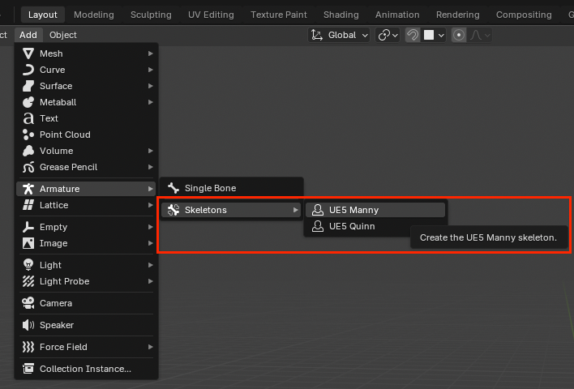

# Blender Addon for Unreal Engine Character Rigging

A lightweight Blender addon to instantly generate industry-standard **UE5 Manny** and **UE5 Quinn** armatures.
Built specifically for the Blender 5.0.1+ API using the modern Bone Collections system.

<!-- begin-markdown-toc -->
## Table of Contents

* [Background](#background)
* [Purpose](#purpose)
* [Getting Started](#getting-started)
* [Testing](#testing)
  * [Local Testing](#local-testing)
  * [Integration Testing](#integration-testing)

<!-- end-markdown-toc -->

## Background

The creation of this plugin started with my own journey of learning how to rig characters for Unreal Engine. While
experimenting with different skeletal meshes, I often ran into frustrating technical issues where the rigs wouldn't
work correctly, especially when trying to set up Inverse Kinematics (IK). To solve these problems and understand
the "why" behind them, I decided to dive deeper into the fundamentals of 3D character creation through
the [GameDev.tv 3D Character course](https://gamedev.tv/courses/blender-anime-character).

Toward the end of that course, I learned how to use the Rigify addon to rig characters in Blender. This sparked
the idea for this project: I wanted a reliable way to rig my Blender characters so they would work perfectly
in Unreal Engine without the usual headaches. I built this tool to make that process automatic and accessible,
ensuring that any character developed in Blender can step right into an Unreal Engine project ready for action.

## Purpose

The addon is designed to bridge the gap between Blender's modeling environment and the Unreal Engine 5 animation
pipeline. While Blender is a powerhouse for mesh creation, ensuring that armature hierarchies, bone orientations,
and naming conventions perfectly align with the **UE5 SK_Mannequin** (Manny and Quinn) can be a tedious and
error-prone process.

This tool automates the generation of production-ready UE5 skeletons, allowing technical artists and animators
to focus on character design rather than manual rigging setup.

The key objectives are:

* **Native Compatibility:** Generates skeletons that match the official Unreal Engine 5 Mannequin
  structure (including root, IK bones, and twist bones) out of the box.
* **Blender 5.0 Integration:** Fully utilizes the modern **Bone Collections** API and the
  updated `VIEW3D_MT_armature_add` menu system to ensure a native-feeling experience in the latest Blender builds.
* **Workflow Efficiency:** Eliminates the need for manual bone placement or renaming by providing one-click "Manny"
  and "Quinn" presets directly from the `Shift + A` menu.

## Getting Started

The addon integrates seamlessly into the native Blender **Add** menu. By navigating to `Armature > Skeletons`,
users can choose between the UE5 Manny or UE5 Quinn skeletons. Alternatively, you can press `Shift + A` in
the 3D Viewport to access the new skeleton presets.



## Testing

### Local Testing

Run the following command to execute the test suite and generate debug `.blend` files in `tests/tmp/`:

```bash
make test
```

### Integration Testing

On every push, GitHub Actions runs the suite on a Linux environment using Blender 5.0.1. If tests fail,
individual `.blend` files with timestamps (e.g., `test_result_manny_20260226_125852.blend`) are uploaded
as artifacts for inspection.
