# Unreal Engine Mannequins

<!-- begin-markdown-toc -->
## Table of Contents

* [Exporting Meshes from Unreal Engine](#exporting-meshes-from-unreal-engine)
* [Importing Mesh to Blender](#importing-mesh-to-blender)
  * [The Armature (The "Skeleton")](#the-armature-the-skeleton)
  * [The Mesh (The "Skin")](#the-mesh-the-skin)
  * [The Modifier (The "Glue")](#the-modifier-the-glue)
  * [Vertex Groups (The "Weighting")](#vertex-groups-the-weighting)
  * [Summary of Relationship](#summary-of-relationship)

<!-- end-markdown-toc -->

## Exporting Meshes from Unreal Engine

The skeletal meshes are located at "All > Content > Characters > Mannequins > Meshes".

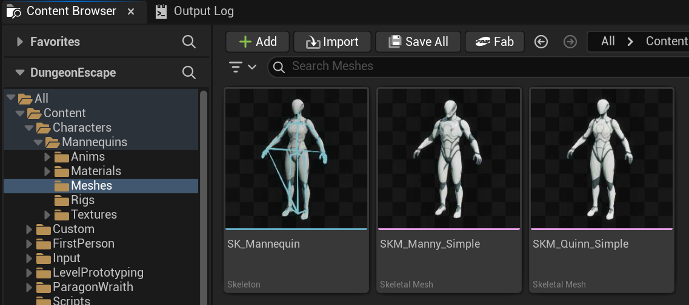

The `SKM_Manny_Simple`:

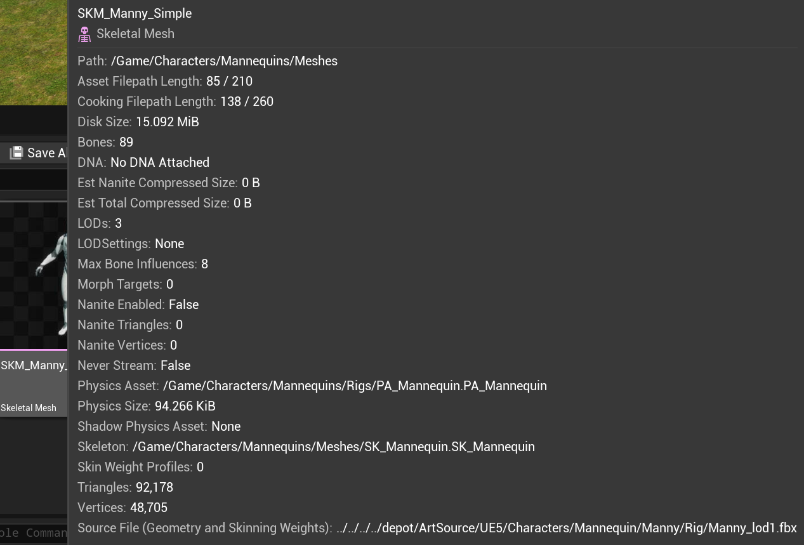

The `SKM_Quinn_Simple`:

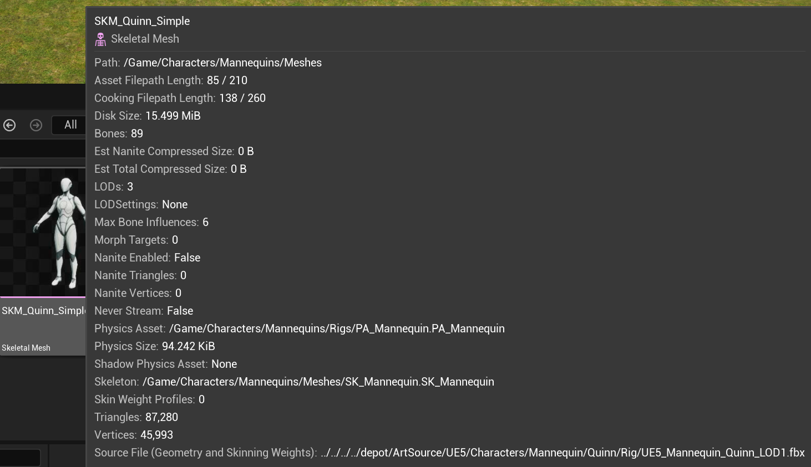

The preview of Quinn mannequin.

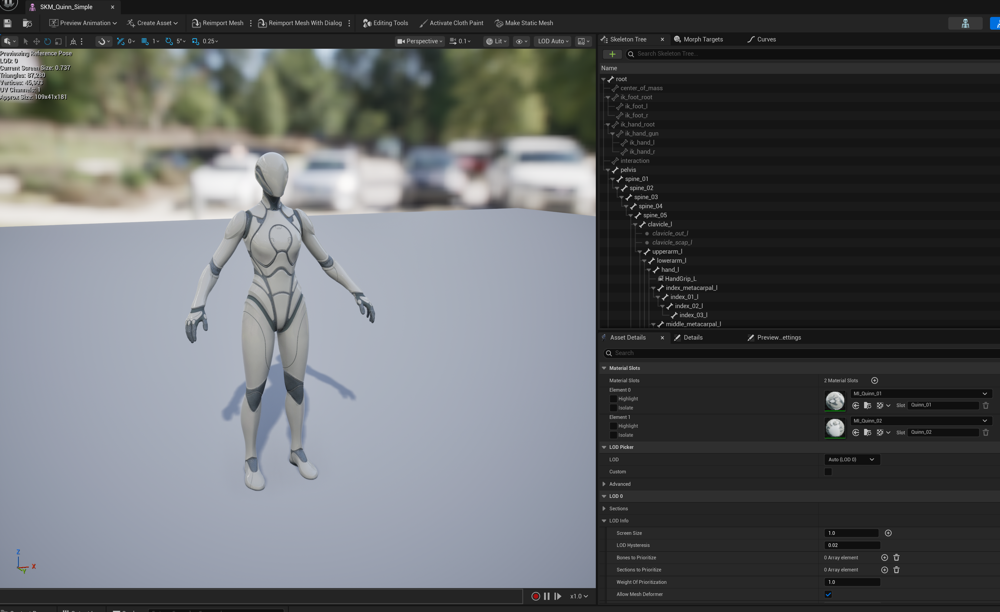

The export settings I used to export the the skeletal mesh (`SKM_`) to `.fbx` files loated [here](./models/).

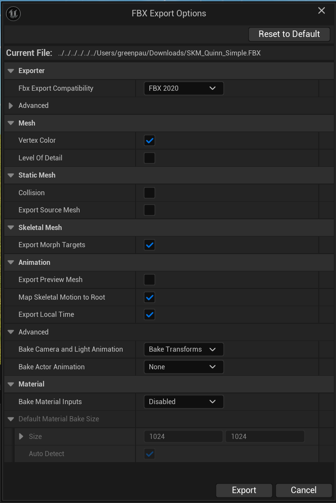

## Importing Mesh to Blender

Click "File > Import > FBX".

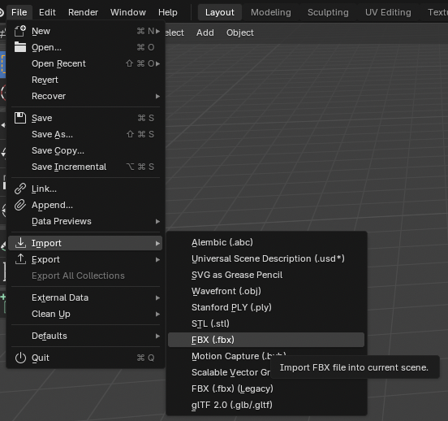

Next, browse to the location of `SKM_Quinn_Simple.FBX`.

Mimic the configuration in this image.

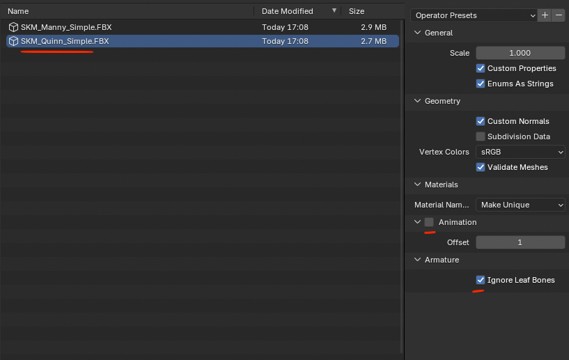

Then, click "Import FBX".

In my scene, I already had unrigged character.

When I imported Quinn, it was placed at the same position as the unrigged character.

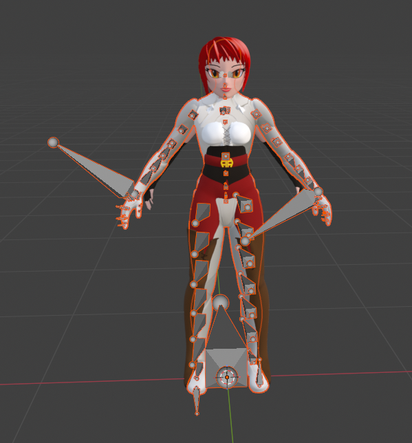

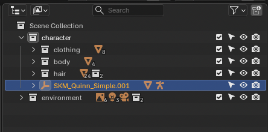

I can hide the unrigged character to see Quinn.

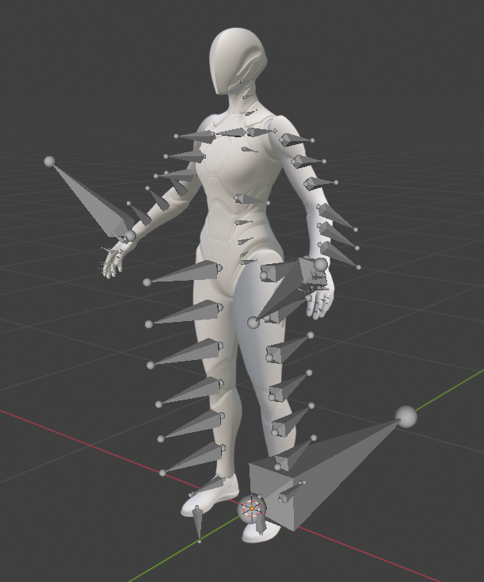

The imported Quinn consists of the following objects.

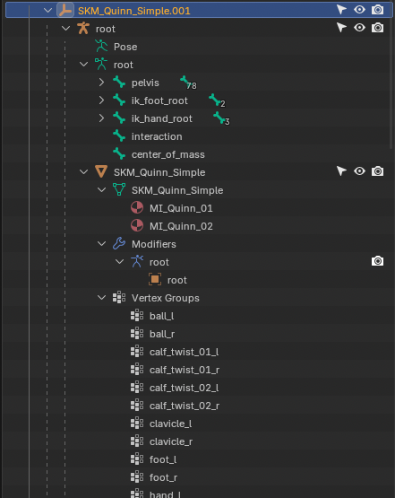

It looks like you’ve imported a character model—specifically the **Quinn** mannequin from Unreal Engine—into **Blender**. What you’re seeing in the Outliner is the standard structural breakdown of a rigged 3D character.

### The Armature (The "Skeleton")

The orange icon labeled **root** at the top is the **Armature Object**. This is the container for the entire skeleton.

* **Pose:** This is where the real-time animation data lives. When you move the character, you are technically
  modifying the Pose.
* **Green "root" (Bone Data):** This represents the actual hierarchy of bones.
  * **pelvis:** The main parent bone for the body.
  * **ik_foot/hand_root:** These are "IK" (Inverse Kinematics) bones. They allow animators to pull a hand or foot
    and have the rest of the arm/leg follow automatically.
  * **interaction/center_of_mass:** These are non-rendering helper bones used by game engines to track the
    character's physical position.

### The Mesh (The "Skin")

The orange triangle icon labeled **SKM_Quinn_Simple** is the **Mesh Object**. This is the actual 3D
geometry (the "skin") of the character.

The **Materials (MI_Quinn_01/02)** are the surface shaders. They tell Blender how shiny or what
color the skin should be.

### The Modifier (The "Glue")

Under the **Modifiers** tab, you see a wrench icon with a blue "root" entry.

This is the **Armature Modifier**. This is the most critical link. It tells
the Mesh: *"Hey, look at the skeleton named 'root' and move your vertices whenever those bones move."* Without
this, the skeleton would move, but the character would just stand still.

### Vertex Groups (The "Weighting")

The list at the bottom (`ball_l`, `clavicle_l`, etc.) represents **Vertex Groups**.

* Each name corresponds exactly to a bone in the skeleton.
* These groups contain data telling the mesh which specific part of the "skin" is controlled by
  which bone. For example, the `foot_l` vertex group tells the mesh that the left foot's
  vertices should follow the `foot_l` bone.

### Summary of Relationship

The **Armature** (Skeleton) drives the movement. The **Armature Modifier** links that movement to
the **Mesh**. The **Vertex Groups** act as the map that tells the mesh exactly which bone
influences which part of the body.
